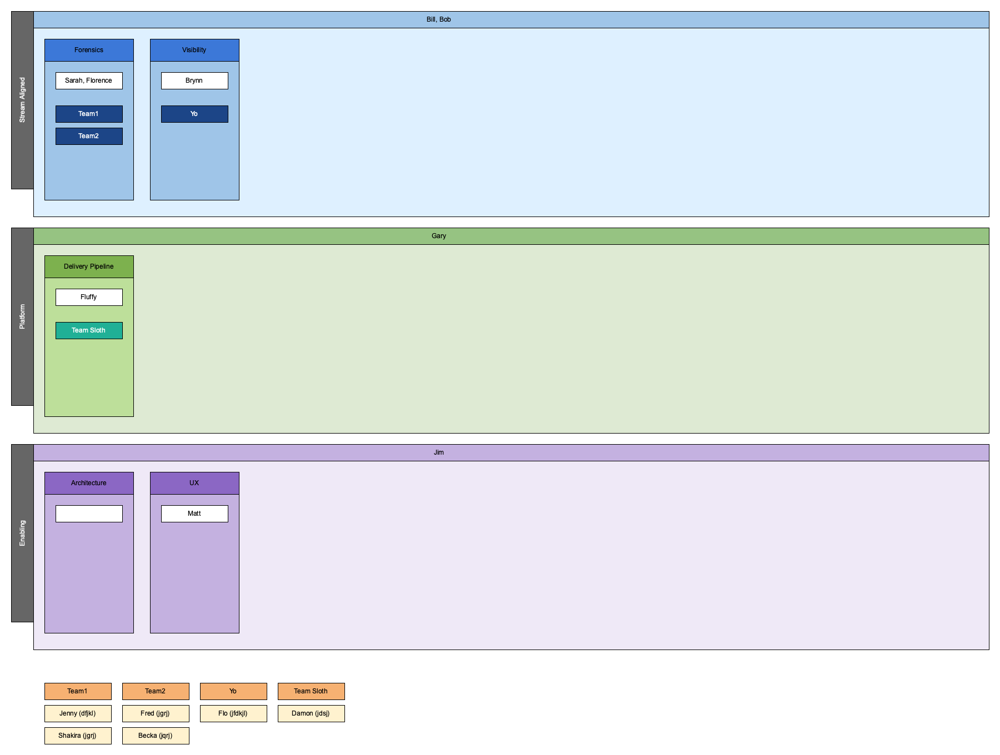

# yamltogliffy
Corporate directories don't always necessarily map directly to teams. Teams, 
especially cross-functional teams typically may be staffed with people who report to 
different managers. 

This makes it a bit of a pain to model teams.

This tool takes an organization model of team types, teams, leaders, people expressed 
in YAML and generates a graphical representation in Gliffy format.

The data model captures the concept of team types, team groups, teams, leaders and 
members of teams.

The example org.yml shown below is directly influenced by the book "Team Topologies: 
Organizing Business and Technology Teams for Fast Flow" although in your org.yml
file you can label the team types as you see fit.

The basic format of the YAML is shown in the example below:

~~~~
teamtypes:
  Stream Aligned:
    leaders:
      - Bill Smith,sdjsjd
      - Bob Smith,ljkdflk
    teamgroups:
      Forensics:
        leaders:
          - Sarah Smith,hjfd
          - Florence Smith,hjod
        teams:
          Team1:
            - Jenny Smith,dfjkl
            - Shakira Smith,jgrj
          Team2:
            - Fred Smith,jgrj
            - Becka Smith,jqrj
      Visibility:
        leaders:
          - Brynn Smith,jfjjk
        teams:
          Yo:
            - Flo Smith,jfdkjl
  Platform:
    leaders:
      - Gary Smith,fdjlk
    teamgroups:
      Delivery Pipeline:
        leaders:
          - Fluffy Smith,jfdj
        teams:
          Team Sloth:
            - Damon Smith,jdsj
  Enabling:
    leaders:
      - Jim Smith,jlkdfs
    teamgroups:
      Architecture:
        leaders:
        teams:
      UX:
        leaders:
          - Matt Smith,jlfdlk
        teams:
~~~~

How to build
------------

First, make sure you have Docker installed then you can run the build script as follows:

    $ ./build.sh

How to run
----------

The following will use the embedded sample org.yml contained in the Docker image

    $ docker run yamltogliffy > mydiagram.gliffy

This by default uses the example org.yml contained within and produces a Gliffy file resembling 
this:

Typically though, you would pass in the org.yml from outside the container as follows (you need
 to map the file to /input/org.yml):

    $ docker run -v ~/org.yml:/input/org.yml  yamltogliffy > jason.gliffy

How to load into Gliffy    
-----------------------

Simply import the generated .gliffy file into [Gliffy](https://www.gliffy.com). 
